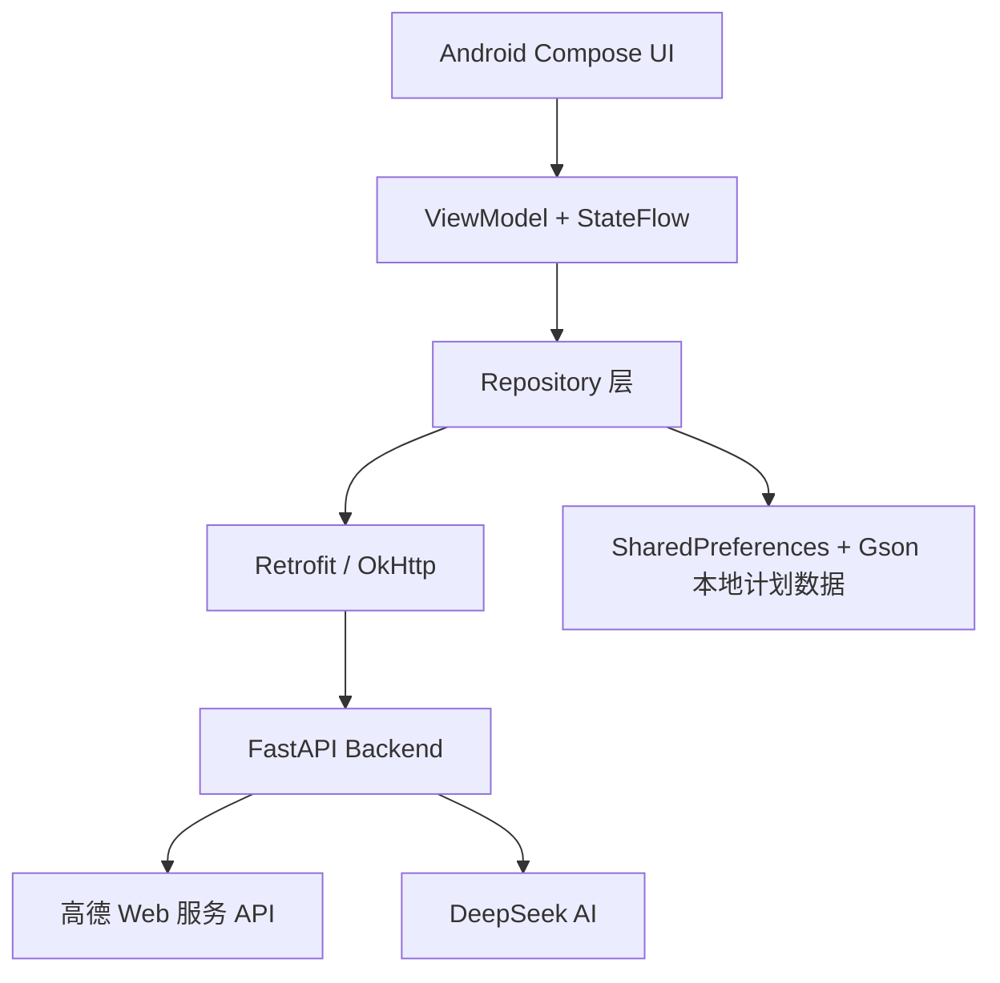

# 途灵 —— 一站式 AI 智能旅行决策管理系统

`travel-app` 是一个 Android + FastAPI 单仓库课程项目，目标是把“旅行灵感探索、真实地点检索、行程计划管理、地图路线规划、AI 行程建议”串成一个可运行的移动端闭环。

当前 Android 开发阶段应用名为“AI旅行助手”，正式包名为 `com.heoclub.aitravel`。

## 当前进度

项目已经不再只是基础框架，而是具备以下核心能力：

- Android 端：Jetpack Compose 三个一级页面“计划 / 探索 / 我的”。
- 探索页：真实高德地图、城市切换、分类 POI、地点搜索、输入提示、真实天气、地点卡片、地点图片和加入计划入口。
- 计划页：创建旅行计划、本地持久化保存、DAY 分组、待规划地点、地点顺序调整。
- 智能计划：输入目的地、日期、天数和偏好，结合高德真实 POI 与 DeepSeek 模型生成逐日结构化行程，并自动保存到本地计划。
- 计划详情：编号 Marker、路线 Polyline、路线距离与耗时、交通方式切换、路线顺序优化预览与确认应用。
- AI 助手：读取当前旅行计划上下文，调用 DeepSeek 模型进行中文问答，并支持结构化行程建议、用户确认后再修改本地计划。
- 后端：FastAPI 代理高德 Web 服务、路线服务、天气服务、内容管道和 DeepSeek AI 服务，避免 Android 端保存服务端 Key。

## 项目结构

```text
F:\travel-app
├── android/                 # Android Studio 工程
│   ├── app/                 # 单 app 模块
│   ├── gradle/              # Gradle Wrapper 与版本目录
│   ├── gradlew
│   └── gradlew.bat
├── backend/                 # FastAPI 后端
│   ├── app/
│   │   ├── api/             # health / explore / routes / ai 接口
│   │   ├── core/            # 配置读取
│   │   ├── schemas/         # 请求与响应模型
│   │   ├── services/        # 高德、路线、天气、AI 服务封装
│   │   └── scripts/         # DeepSeek Key 验证脚本等
│   ├── tests/
│   ├── .env.example
│   └── requirements.txt
├── docs/                    # 阶段文档与架构说明
├── .gitignore
└── README.md
```

## 技术栈

### Android

- Kotlin 1.9.24
- Jetpack Compose + Material 3
- Navigation Compose
- ViewModel + StateFlow
- Retrofit + OkHttp
- Gson
- Coil
- 高德 Android 地图 SDK
- SharedPreferences + Gson JSON 本地持久化
- Gradle 8.7、AGP 8.5.2、JDK 17
- compileSdk / targetSdk 34，minSdk 28

### Backend

- Python 3.13 验证环境
- FastAPI
- Uvicorn
- Pydantic Settings
- HTTPX
- Pytest
- 高德 Web 服务 API
- DeepSeek OpenAI-compatible API

## 整体架构



Android 端只保存 Android 地图 SDK Key，用于地图渲染；高德 Web 服务 Key 和 DeepSeek API Key 只放在 FastAPI 后端 `.env` 中。

## 功能说明

### 1. 探索页

探索页是当前 App 的真实地点入口。

已实现：

- 高德地图浅色风格展示。
- 城市搜索与城市切换。
- 分类切换：
  - 景点 `scenic`
  - 美食 `food`
  - 饮品 `drink`
  - 购物 `shopping`
  - 住宿 `lodging`
  - 交通 `transport`
- 根据当前城市和分类加载真实高德 POI。
- 地图 Marker 与底部地点列表联动。
- 地点搜索页调用高德输入提示和地点搜索。
- 城市天气调用高德天气接口。
- 地点图片优先使用高德返回的图片字段；缺失时不编造真实图片。
- 地点可加入指定旅行计划的 DAY 或待规划列表。

### 2. 计划与计划详情

已实现：

- 创建旅行计划。
- 计划数据本地持久化，重启 App 后保留。
- 添加真实高德地点到计划。
- 支持 DAY 地点和待规划地点。
- 防止重复添加同一地点。
- 缺少坐标的地点不会参与路线计算。
- 地点上移 / 下移。
- 计划详情地图展示编号 Marker。
- 后端计算真实路线后，Android 绘制 Polyline。
- 列表展示每段距离和预计耗时。
- 支持步行、驾车、骑行、公交 / 地铁等路线模式。
- 支持“智能优化路线”预览，用户确认后才应用顺序。

### 3. AI 旅行助手

AI 助手不是孤立的聊天机器人，而是可以读取当前旅行计划上下文的行程顾问。

已实现：

- 从计划详情进入 AI 时携带当前 `planId`。
- Android 整理精简计划上下文：
  - 计划名称、目的地、日期
  - DAY 地点
  - 待规划地点
  - 地点名称、类别、地址、图片 URL
  - 路线摘要
  - 天气摘要
  - 最近对话历史
- FastAPI 调用 DeepSeek 模型生成中文回复。
- 支持加载中、错误、重试和快捷追问。
- 支持结构化建议动作：
  - 移动地点到某个 DAY
  - 调整地点顺序
  - 将待规划地点安排进 DAY
  - 将地点移回待规划
- AI 不直接修改计划，必须由用户确认。
- 应用 AI 建议后会更新本地计划，并支持最近一次 AI 修改撤销。

AI 行为边界：

- AI 可以分析行程是否太赶、解释路线、给天气提醒、建议待规划地点放入哪一天。
- AI 不应声称已经替用户删除、添加或应用修改；所有计划修改必须经过 Android 端确认。
- 如果缺少真实路线、天气、营业时间等数据，AI 应说明“当前暂无可用数据”，不要编造。

### 4. 智能计划生成

- 创建页支持目的地、日期范围、1–10 天、旅行偏好和补充想法。
- 支持城市联想、日期范围选择、旅行节奏、交通偏好和每日活动时段约束。
- 后端先解析城市并检索高德真实 POI，再读取本地官方来源目录与体验证据；带明确生效日期的闭园公告直接形成硬约束，预约要求、A 级认证、有效笔记量与拥挤证据进入评分和提示。
- 草案采用带时间窗的贪心插入与 `2-opt / relocate / swap / replace` 局部搜索；地理分区后继续执行跨日 `day-move / swap`，避免先平均分景点再补交通。
- 每段时间从上一地点离开时间、高德实际通勤、入口缓冲和安检时间向后推演；火车站与机场按类型预留提前到站时间。
- 每日顺序先用高德道路距离矩阵重新求解，再对最终相邻地点逐段比较步行、公交地铁、骑行与驾车；矩阵用于选序，最终展示只采用逐段路线接口的实际距离和耗时。
- 高德真实耗时导致时段冲突时，确定性修复器会优先尝试同片区、当日开放候选；必去地点、住宿或离开锚点无法满足时直接返回明确错误，不会静默删掉硬约束。
- 营业解析区分开放、最晚入场/停止售票和闭馆；复杂文本会按行程日期筛选 7 月至 8 月、07-09 至 08-31 等季节段，不能只看当天最晚的闭馆时间。
- 餐馆按路线走廊插入，并由高德真实路线复核绕行时间；早餐约束在住宿/首站附近，午餐额外绕行不超过 15 分钟或 2 公里，晚餐距最后锚点不超过约 20 分钟。
- 原餐馆被真实路线判定绕行过远后，会在相同餐期重新选择并校验走廊餐馆；附近召回先搜索城市特色菜，再回退普通正餐，甜品与冷饮不能承担早餐、午餐或晚餐。
- 天气会参与硬过滤、跨日换位和室内外评分；32°C 起不采用骑行，33°C 起额外召回博物馆等室内文化地点，并把室外游览限制在上午或 16:30 后。每天最多返回 2 个同片区备选，替换后要求重新刷新路线。
- 夜景、夜市、外滩、城墙、江滩、观景塔等地点可形成 17:30 后的夜游时间窗；道路矩阵二次求解必须保留该窗口，晚餐可在夜游前顺路插入。
- “故宫必须去”“第 2 天故宫 10:00 预约”“不要去王府井”等补充要求会先解析为独立地点约束：必去点单独向高德召回，最终真实路线完成后再次检查是否保留。
- 官方节假日开放调整优先于常规周营业时间；接驳停运、限定入口和交通管制只形成访问提示，不会误判为整座景区闭园。
- 官方最大日承载量、票价和预约规则会进入地点说明与 AI 只读上下文；带明确生效日期的“预约已满、售罄、达到最大承载量或停止售票”公告会将该景点标记为当日不可用，无日期的历史票务信息只作为提示。
- 高德逐段路线核验完成后才调用 DeepSeek。模型只能返回候选 `sourcePoiId` 的局部补丁，不能创建地点或重写整份行程。
- AI 补丁必须重新通过闭馆、餐期、锚点、路线完整性、通勤和强度校验，综合目标至少提升 3% 才会采纳。
- AI 优化期间持续发布等待心跳，不设置额外的服务层硬截止；模型返回后再验收局部补丁，格式不合格或没有量化收益时保留约束草案。
- 车站、机场和酒店仅在用户明确选择时加入；选择目的城市不会预取或展示到达/离开点，只有用户实际输入至少 2 个字符后才请求城市内联想。
- Android 使用服务端任务 ID 获取真实阶段进度，支持取消、失败重试、地图预览和逐日内容揭示。
- 结果包含真实 POI 比例、重复地点数、数据来源、每日直线距离估算和行程强度。
- 结构化结果一次性写入本地计划，避免只保存一半行程；生成完可直接进入原有计划详情继续编辑和算路线。
- 服务端要求返回完整的 Day 1…Day N；晚到或早离日可以只有用户明确设置的锚点，普通游览日没有可执行景点时任务失败，不返回缺天数的半成品。
- APK 调研证据、接口字段和本项目映射见 `docs/apk-ai-planning-analysis.md`。

## 后端接口

启动后端后可打开：

```text
http://127.0.0.1:8000/docs
```

当前主要接口：

| 模块 | 方法 | 路径 | 说明 |
| --- | --- | --- | --- |
| 基础 | GET | `/` | 欢迎信息 |
| 健康 | GET | `/api/health` | 后端基础健康检查 |
| 健康 | GET | `/api/health/amap` | 高德 Web 服务 Key 配置状态 |
| 健康 | GET | `/api/health/reviews` | 授权 UGC 提供方、授权开关与配置状态 |
| 健康 | GET | `/api/health/ai` | DeepSeek AI 配置状态 |
| 探索 | GET | `/api/explore/cities/search` | 城市搜索 |
| 探索 | GET | `/api/explore/input-tips` | 地点输入提示 |
| 探索 | GET | `/api/explore/pois/search` | 城市分类 POI / 关键词地点搜索 |
| 探索 | POST | `/api/explore/pois/detail` | 立即返回三层地点档案；缺失体验数据进入后台队列 |
| 探索 | POST | `/api/explore/reviews/batch` | 批量检查并补全 1～30 个最终行程 POI |
| 探索 | GET | `/api/explore/reviews/batches/{batchId}/events` | 流式返回地点体验缓存与聚合状态 |
| 内容 | GET | `/api/content/catalog` | 查看全国热门 POI 种子目录 |
| 内容 | POST | `/api/content/ingestion/runs` | 启动最多 30 个 POI 的清洗、去重、聚合任务（管理令牌） |
| 内容 | GET | `/api/content/ingestion/runs/{runId}` | 查询采集数量、入库数量和明确的上游错误（管理令牌） |
| 内容 | GET | `/api/content/targets` | 查看热门/冷门目标及下次刷新时间（管理令牌） |
| 内容 | GET | `/api/content/stats` | 查看地点、证据、聚合和任务统计（管理令牌） |
| 内容 | POST | `/api/content/official/sync` | 同步已适配景区的官方公告（管理令牌） |
| 内容 | POST | `/api/content/cities/bootstrap` | 按城市从高德发现热门景点并创建采集目标（管理令牌） |
| 内容 | GET | `/api/content/official/sources` | 查询 A 级认证、官网、公众号、小程序和票务来源目录 |
| 内容 | GET | `/api/content/mediacrawler/exports` | 列出本机 MediaCrawler JSONL 输出（管理令牌） |
| 内容 | POST | `/api/content/mediacrawler/import` | 清洗并导入真实小红书采集结果（管理令牌） |
| 内容 | POST | `/api/content/cities/plan` | 冻结指定城市 Top 12 POI 榜单与采集关键词（管理令牌） |
| 内容 | POST | `/api/content/city-runs` | 启动单城市 MediaCrawler 采集、清洗和入库任务（管理令牌） |
| 内容 | GET | `/api/content/city-runs/{runId}` | 查询城市及逐 POI 采集进度（管理令牌） |
| 探索 | GET | `/api/explore/weather` | 城市天气 |
| 路线 | POST | `/api/routes/segment` | 两点路线 |
| 路线 | POST | `/api/routes/day/calculate` | 单日多地点路线 |
| 路线 | POST | `/api/routes/day/optimize` | 单日地点顺序优化 |
| AI | POST | `/api/ai/chat` | 计划上下文 AI 对话 |
| AI | POST | `/api/ai/plans/generate` | 基于真实 POI 生成结构化多日行程 |
| AI | POST | `/api/ai/plans/jobs` | 创建异步智能规划任务，重复请求 ID 幂等 |
| AI | GET | `/api/ai/plans/jobs/{jobId}` | 查询真实进度、Day 增量地点、规划事件和最终结果 |
| AI | POST | `/api/ai/plans/jobs/{jobId}/cancel` | 取消正在执行的规划任务 |

Android Debug 构建默认使用本机真机联调地址 `http://127.0.0.1:8000/`，通过
`adb reverse tcp:8000 tcp:8000` 转发到电脑上的 FastAPI。Release 构建仍单独读取
`API_BASE_URL`，以后部署云端时不需要修改业务代码。

### Windows 真机一键联调

先在手机上开启开发者选项与 USB 调试，用数据线连接电脑，并在手机上允许这台电脑调试。
然后从仓库根目录运行：

```powershell
powershell -ExecutionPolicy Bypass -File .\scripts\start-local-device-debug.ps1
```

脚本会检查真机授权、建立 ADB 端口反向转发、启动本机 FastAPI，并保留
`backend/data/reviews.sqlite3` 与 `backend/data/users.sqlite3`。首次注册时用户库会自动创建；
已有数据库不会被脚本清空或替换。脚本成功后，直接在 Android Studio 运行 `app` 的 Debug 配置。

结束联调时运行：

```powershell
powershell -ExecutionPolicy Bypass -File .\scripts\stop-local-device-debug.ps1
```

如果需要覆盖默认本机地址，可以在 `android/local.properties` 中设置：

```properties
LOCAL_DEVICE_API_BASE_URL=http://127.0.0.1:8000/
```

模拟器不使用 `adb reverse`，可这样构建：

```powershell
.\gradlew.bat :app:assembleDebug -PAI_TRAVEL_API_BASE_URL=http://10.0.2.2:8000/
```

## 环境变量与密钥

### 后端 `.env`

复制模板：

```powershell
cd F:\travel-app\backend
Copy-Item .env.example .env
```

然后在 `backend\.env` 中填写本机配置。不要把 `.env` 提交到 Git。

```env
APP_NAME=AI Travel API
APP_VERSION=0.1.0
DEBUG=true
DEV_CORS_ORIGINS=http://localhost:3000,http://localhost:5173,http://127.0.0.1:3000,http://127.0.0.1:5173

AMAP_WEB_SERVICE_KEY=

# 可选：只有已取得相应数据使用授权后才能打开
UGC_PROVIDER_AUTHORIZED=false
TIKHUB_API_KEY=
TIKHUB_BASE_URL=https://api.tikhub.io
TIKHUB_CONNECT_TIMEOUT_SECONDS=5
TIKHUB_READ_TIMEOUT_SECONDS=12
TIKHUB_MAX_SOURCES=6
REVIEW_DATABASE_PATH=data/reviews.sqlite3
REVIEW_AUTHOR_HASH_SALT=请替换为生产环境随机盐
CONTENT_ADMIN_TOKEN=请设置至少16位且只保存在后端的管理令牌
MEDIACRAWLER_TOOL_DIR=../tools/MediaCrawler
MEDIACRAWLER_RUN_DIR=data/mediacrawler-runs
MEDIACRAWLER_TIMEOUT_SECONDS=10800

DEEPSEEK_API_KEY=
DEEPSEEK_MODEL=deepseek-chat
DEEPSEEK_BASE_URL=https://api.deepseek.com/v1
DEEPSEEK_REQUEST_TIMEOUT_SECONDS=240
DEEPSEEK_MAX_OUTPUT_TOKENS=8000
DEEPSEEK_TEMPERATURE=0.35
```

说明：

- `AMAP_WEB_SERVICE_KEY` 用于后端调用高德 Web 服务，包括 POI、输入提示、天气和路线。
- `TIKHUB_API_KEY` 只用于已经取得相应数据使用授权的内容适配器；还必须显式设置 `UGC_PROVIDER_AUTHORIZED=true` 才会启用。
- 未启用授权 UGC 或上游不可用时，页面继续展示高德地点事实与官方内容，不会伪造真实评价。
- `REVIEW_DATABASE_PATH`、`REVIEW_AUTHOR_HASH_SALT` 和 `CONTENT_ADMIN_TOKEN` 用于 PR #11 引入的内容清洗、匿名化、缓存和管理接口。
- 生产环境接入前应确认内容展示、缓存、跳转和用户隐私符合平台条款；服务端只返回来源标题、作者、短摘要和原文链接，不复制完整笔记。
- `DEEPSEEK_API_KEY` 用于后端调用 DeepSeek 模型；所有 AI 对话与智能规划共用该提供商。
- README 只保留变量名，不应出现真实 Key。

### Android `local.properties`

Android 地图 SDK Key 放在：

```text
F:\travel-app\android\local.properties
```

示例：

```properties
sdk.dir=C\:\\Users\\你的用户名\\AppData\\Local\\Android\\Sdk
AMAP_ANDROID_KEY=你的高德 Android 平台 Key
```

`android/local.properties` 已被 `.gitignore` 忽略，不要提交。

## 启动后端

首次安装：

```powershell
cd F:\travel-app\backend
py -3.13 -m venv .venv
.\.venv\Scripts\python.exe -m pip install -r requirements.txt
```

### 测试阶段内容同步

不启动 HTTP 服务也可以运行后台管道：

```powershell
cd F:\Projects\travel\backend
# 仅同步故宫官方信息
.\.venv\Scripts\python.exe scripts\sync_content.py --official-source dpm
# 批量处理前 10 个热门 POI；只有 UGC_PROVIDER_AUTHORIZED=true 时才会请求 UGC
.\.venv\Scripts\python.exe scripts\sync_content.py --limit 10 --include-official
# 为任意城市自动建立热门景点目录
.\.venv\Scripts\python.exe scripts\sync_content.py --bootstrap-city 天津市 --limit 12
# 同步当前已实现的五个官方站点
.\.venv\Scripts\python.exe scripts\sync_content.py --official-source all
# 导入 MediaCrawler 的本地 JSONL
.\.venv\Scripts\python.exe scripts\sync_content.py --import-mediacrawler search_contents_2026-07-22.jsonl --city 天津市
```

清洗过程会校验 POI 相关性，去除 URL/联系方式，过滤纯广告，对笔记 ID 和规范化正文去重，并提取拍照、排队、预约、步行量、美食、是否值得等结构化标签。上游的鉴权、余额、限流和网络错误会写入任务状态，不会再被当成“没有相关笔记”。

排查采集器本身时仍可直接运行 `tools\MediaCrawler`；正常建库不要使用这条手工路径：

```powershell
cd F:\Projects\travel\tools\MediaCrawler
.\.venv\Scripts\python.exe main.py --platform xhs --lt qrcode --type search `
  --keywords "天津五大道文化旅游区,民园广场,小白楼" `
  --get_comment false --get_sub_comment false --save_data_option jsonl
```

浏览器登录态会保存在 MediaCrawler 自己的 `browser_data` 目录；首次或登录过期时需要扫码。采集输出只作为输入文件，业务数据库仍由本项目统一清洗、匿名化和聚合。

推荐使用城市自动管道，不再手工拼接关键词。默认每城选择 12 个景点，每景点抓取 30 篇候选，清洗后最多保留 20 条证据，详情接口展示最相关的 8 条：

```powershell
cd F:\Projects\travel\backend

# 先检查高德榜单和 POI 映射，不启动浏览器
.\.venv\Scripts\python.exe scripts\build_city_content.py --city 天津市 --plan-only

# 首次运行显示浏览器，登录状态失效时扫码
.\.venv\Scripts\python.exe scripts\build_city_content.py --city 天津市

# 顺序处理四个直辖市；保持可见浏览器，登录失效时可直接扫码
.\scripts\run_municipality_content.ps1
```

当前自动采集范围固定为北京市、上海市、天津市、重庆市，每城 Top 12。脚本复用已有缓存，不会清空或重复覆盖已经入库的证据。

每次运行使用独立的 `runId` 目录和查询清单，JSONL 通过精确的 `queryKeyword -> AMap POI ID` 映射导入，不再按短名称猜测地点。任务按城市和 POI 持久化；单个城市失败后继续处理后续城市。原始 JSONL 与日志只作为暂存数据，7 天后在下一次采集开始时自动清理。

默认只采集没有证据或已经到刷新时间的 POI：城市榜单前 5 名每 7 天刷新，其余每 30 天刷新。需要重建全部内容时显式增加 `--force`。

如果返回 `login_required`，表示保存的小红书登录态已过期。重新运行同一城市但不要加 `--headless`，在浏览器中扫码后即可继续；系统不会绕过二维码或验证码。

启动服务：

```powershell
cd F:\travel-app\backend
.\.venv\Scripts\python.exe -m uvicorn app.main:app --host 127.0.0.1 --port 8000
```

如果 Android 模拟器需要访问后端，Android Debug 构建默认使用：

```text
http://10.0.2.2:8000/
```

因此后端也可以启动为：

```powershell
.\.venv\Scripts\python.exe -m uvicorn app.main:app --host 0.0.0.0 --port 8000
```

浏览器验证：

```text
http://127.0.0.1:8000/docs
```

## 启动 Android

推荐直接用 Android Studio 打开：

```text
F:\travel-app\android
```

不要只打开仓库根目录，否则 Android Studio 可能不能自动识别 `app` 运行配置。

命令行构建：

```powershell
cd F:\travel-app\android
.\gradlew.bat :app:assembleDebug
```

运行前请确认：

- Android Studio 使用 JDK 17 或内置 JBR。
- `android/local.properties` 中有 Android SDK 路径。
- `AMAP_ANDROID_KEY` 已配置。
- FastAPI 后端正在运行。
- Debug 构建可访问 `http://10.0.2.2:8000/`。

## 联调流程建议

1. 启动 FastAPI。
2. 打开 `http://127.0.0.1:8000/docs`，确认接口列表存在。
3. 在 Swagger 中确认：
   - `/api/health`
   - `/api/health/amap`
   - `/api/health/ai`
4. 用 Android Studio 打开 `F:\travel-app\android`。
5. 运行 `app` 到 Pixel 模拟器。
6. 进入探索页，切换城市并加载真实地点。
7. 添加 2-3 个地点到某个计划 DAY 1。
8. 进入计划详情，检查 Marker、路线、距离、耗时。
9. 点击 AI 助手，询问行程是否太赶或如何优化。
10. 如 AI 返回结构化建议，先预览，再确认应用。

## 测试与验证命令

后端静态编译检查：

```powershell
cd F:\travel-app\backend
.\.venv\Scripts\python.exe -m compileall app
```

后端单元测试：

```powershell
cd F:\travel-app\backend
.\.venv\Scripts\python.exe -m pytest
```

DeepSeek 配置低成本验证：

```powershell
cd F:\travel-app\backend
.\.venv\Scripts\python.exe -m app.scripts.verify_deepseek
```

Android 构建：

```powershell
cd F:\travel-app\android
.\gradlew.bat :app:assembleDebug
```

## 数据与安全

- 计划数据目前保存在 Android App 私有空间中，使用 `SharedPreferences + Gson JSON`。
- 卸载 App 会清除本地计划数据。
- 当前不做账号登录、云端同步和多设备同步。
- 路线结果不长期持久化，进入计划详情时会重新向后端请求计算。
- 高德 Web 服务 Key 和 DeepSeek API Key 只应保存在 `backend/.env`。
- Android 端只保存高德 Android 地图 SDK Key。
- `.gitignore` 已忽略 `.env`、`local.properties`、虚拟环境、构建产物、APK、签名文件和常见系统文件。

## 常见问题

### 1. 探索页显示“请检查后端服务是否启动”

请检查：

- FastAPI 是否正在运行。
- 后端端口是否是 `8000`。
- Android Debug 构建是否使用 `http://10.0.2.2:8000/`。
- Windows 防火墙是否拦截。
- 后端 `.env` 中 `AMAP_WEB_SERVICE_KEY` 是否配置。

### 2. 地图能显示，但地点、天气或路线加载失败

地图 SDK 和 Web 服务是两套 Key：

- 地图渲染使用 `AMAP_ANDROID_KEY`。
- POI、天气、路线使用 `AMAP_WEB_SERVICE_KEY`。

如果地图正常但接口失败，优先检查后端 `.env` 和高德 Web 服务 Key 的服务权限 / 配额。

### 3. AI 经常超时

当前 Android 和后端都已把 AI 请求超时设置得较长，但模型响应仍取决于网络、模型负载、上下文长度和账号额度。

建议：

- 问题尽量具体。
- 不要一次发送过多地点和过长历史。
- 检查 `DEEPSEEK_REQUEST_TIMEOUT_SECONDS`。
- 检查 DeepSeek 控制台的 API Key 和额度状态。

### 4. 中文输入异常

如果模拟器输入框不能输入中文，通常是模拟器系统输入法问题，不一定是 App Bug。可在模拟器中安装或启用中文输入法后再测试。

### 5. Android Studio 打开根目录后没有运行配置

请打开：

```text
F:\travel-app\android
```

不是只打开：

```text
F:\travel-app
```

## 当前限制

- 暂无登录注册和云端同步。
- 暂无 Room 数据库。
- 暂无实时定位、实时导航和语音导航。
- 暂无可直接用于商业发布的小红书官方内容授权；当前 UGC 适配器默认关闭，测试 Key 没有可用额度时任务会明确返回 `QUOTA_EXHAUSTED`。
- AI 不直接修改计划，所有结构化建议都必须由用户确认。
- 智能规划和地点体验补全均支持 SSE 流式状态更新。
- 地址、坐标、营业时间、评分和电话以高德/景区官方为事实来源；拍照、排队、步行量等只作为有证据的体验聚合，不冒充事实。

## 后续路线

建议后续按以下顺序推进：

1. 优化 AI 对话体验：上下文裁剪、失败重试、中文提示词稳定性。
2. 增加计划编辑体验：拖拽排序、跨 DAY 移动、待规划批量安排。
3. 在现有故宫适配器基础上扩展全国重点景区的官网公告、预约与票价连接器，并为页面结构变化加监控告警。
4. 增加用户系统：登录、云端同步、多设备保存。
5. 将单机 SQLite/内存队列迁移为 PostgreSQL + Redis/Celery，并加入分布式 POI 去重锁。
6. 接入已授权 UGC / 自有评价和官方开放数据，建立删除同步与审计流程。
7. 增加课程展示材料：架构图、接口文档、演示脚本和答辩 PPT。

## Git 提交前检查

提交前建议执行：

```powershell
git status --short
git check-ignore -v backend/.env
git check-ignore -v android/local.properties
git check-ignore -v android/app/build/outputs/apk/debug/app-debug.apk
```

确认以下文件不要提交：

- `backend/.env`
- `backend/.venv/`
- `android/local.properties`
- `android/**/build/`
- `*.apk`
- `*.jks`
- `*.keystore`
- 任何真实 API Key 或签名文件

