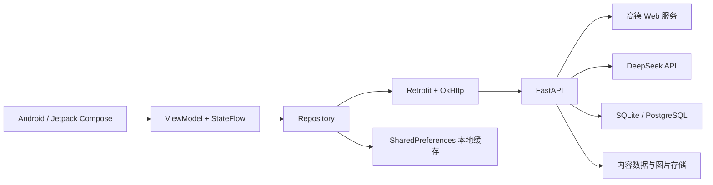

# 途灵——一站式 AI 智能旅行决策与管理系统


途灵是一套面向旅行规划场景的 Android + FastAPI 课程项目。系统把城市与景点探索、AI 行程生成、地图路线规划、旅行计划管理、个人足迹和旅行游记整合在同一个移动端应用中，并通过后端统一接入高德 Web 服务、DeepSeek、用户数据库和内容数据服务。

本仓库采用前后端分离结构：Android 客户端负责交互、地图展示和本地缓存；FastAPI 后端负责账号认证、第三方 API 代理、AI 规划、路线计算、用户数据同步和图片上传。服务端密钥不会写入 Android 源码。

## 1. 项目亮点

- 基于 Jetpack Compose + Material 3 的原生 Android 界面，包含“计划 / 探索 / 旅程 / 我的”四个一级模块。
- 使用高德地图与 Web 服务完成城市检索、POI 搜索、逆地理编码、天气查询和多方式路线规划。
- 使用 DeepSeek 生成结构化多日行程，并结合景点开放时间、真实通勤、天气、游览强度和用户偏好进行约束求解。
- AI 助手能够读取当前行程上下文，给出可预览、可确认、可撤销的调整建议，不会直接覆盖用户计划。
- 支持验证码注册、登录、JWT 访问令牌与刷新令牌、个人资料、旅行计划、足迹和游记的云端同步。
- 支持游记富文本编辑、搜索、分享图生成和图片上传。
- 后端默认使用 SQLite，亦可通过 `DATABASE_URL` 切换到 PostgreSQL，适合本地演示和云端部署。
- 后端提供 Swagger / OpenAPI 文档，并配有较完整的 Pytest 与 Android 单元测试。

## 2. 核心功能

### 2.1 计划与智能规划

- 创建、删除和搜索旅行计划，设置目的地、日期、天数、节奏和交通偏好。
- 将景点加入指定日期或“待规划”列表，调整游览顺序、时间和跨天安排。
- 在地图上查看每日编号 Marker、路线 Polyline、分段距离、预计耗时和交通方式。
- 基于真实 POI、天气、开放时间、预约约束和道路路线生成完整的 Day 1 至 Day N 行程。
- 支持异步规划任务、实时进度、取消、失败重试和结果一次性导入。

### 2.2 探索与地图

- 城市搜索、城市切换、当前位置和逆地理编码。
- 按景点、美食、饮品、购物、住宿、交通等分类浏览 POI。
- 地点关键词搜索、输入提示、搜索历史、地图与列表联动。
- 查看地址、坐标、评分、营业时间、图片、官方信息和有来源的体验摘要。
- 将地点直接加入现有旅行计划。

### 2.3 AI 旅行助手

- 使用当前计划、每日地点、路线、天气和最近对话作为上下文进行中文问答。
- 支持流式回答和 Markdown 内容展示。
- 可建议移动地点、调整顺序、安排待规划地点等结构化动作。
- 所有计划变更都需要用户确认，并支持撤销最近一次 AI 修改。

### 2.4 账号、足迹与游记

- 图形验证码、注册、登录和 Token 自动刷新。
- 编辑个人资料并同步用户旅行数据。
- 保存旅行足迹和旅行计划。
- 创建、编辑、搜索和删除旅行游记，添加照片并生成分享图。
- 后端提供 JPEG、PNG、WebP、GIF 图片上传接口，默认限制为 10 MB。

## 3. 系统架构



数据流如下：

1. Android 页面通过 ViewModel 管理状态和用户操作。
2. Repository 负责本地缓存、远程请求和登录后的云端同步。
3. Retrofit 调用 FastAPI；Android 端只保存高德 Android SDK Key。
4. FastAPI 统一访问高德 Web 服务、DeepSeek、数据库和内容数据源。
5. 账号、计划、足迹和游记可写入 SQLite 或 PostgreSQL；未登录状态仍可使用部分本地能力。

## 4. 技术栈

| 层级 | 主要技术 |
| --- | --- |
| Android | Kotlin 1.9.24、Jetpack Compose、Material 3、Navigation Compose、ViewModel、StateFlow |
| 网络与图片 | Retrofit 2.11、OkHttp 4.12、Gson、Coil |
| 地图 | 高德地图、定位与搜索 SDK 11.2.000 |
| Android 构建 | Gradle 8.7、Android Gradle Plugin 8.5.2、JDK 17、compileSdk / targetSdk 34、minSdk 28 |
| 后端 | Python、FastAPI 0.115、Uvicorn、Pydantic Settings、HTTPX |
| 数据库 | SQLAlchemy Async、SQLite + aiosqlite、PostgreSQL + asyncpg |
| 认证与上传 | JWT、bcrypt / passlib、Pillow、python-multipart |
| AI 与数据服务 | DeepSeek OpenAI-compatible API、高德 Web 服务、可选授权 UGC 数据源 |
| 测试 | Pytest、pytest-asyncio、JUnit 4、kotlinx-coroutines-test |

## 5. 项目结构

```text
travel-app/
├─ android/                         # Android Studio 工程
│  ├─ app/
│  │  └─ src/
│  │     ├─ main/
│  │     │  ├─ java/com/heoclub/aitravel/
│  │     │  │  ├─ data/            # DTO、本地存储、Retrofit、Repository
│  │     │  │  ├─ di/              # 轻量依赖容器
│  │     │  │  ├─ navigation/      # 页面路由与底部导航
│  │     │  │  └─ ui/              # 计划、探索、AI、游记、账号等界面
│  │     │  └─ res/                 # 图标、图片、字符串、网络配置
│  │     └─ test/                   # Android 本地单元测试
│  ├─ gradle/                       # Gradle Wrapper 与版本目录
│  ├─ build.gradle.kts
│  └─ settings.gradle.kts
├─ backend/                         # FastAPI 后端
│  ├─ app/
│  │  ├─ api/                       # auth、user、explore、routes、ai、upload、content
│  │  ├─ core/                      # 配置、数据库、认证安全
│  │  ├─ models/                    # SQLAlchemy 数据模型
│  │  ├─ schemas/                   # Pydantic 请求与响应模型
│  │  ├─ services/                  # 高德、AI、规划器、内容处理等业务服务
│  │  └─ main.py                    # FastAPI 应用入口
│  ├─ scripts/                      # 内容同步和城市数据构建脚本
│  ├─ tests/                        # 后端测试
│  ├─ DEPLOY.md                     # 服务器部署补充说明
│  └─ requirements.txt
├─ docs/                            # 架构、内容管道与规划分析文档
├─ scripts/                         # Windows 真机联调启动/停止脚本
├─ logo.jpg
└─ README.md
```

## 6. 运行环境

开始前请安装：

- Git
- Python 3.10 或更高版本（推荐 3.11～3.13）
- Android Studio 与 Android SDK 34
- JDK 17（可直接使用 Android Studio 自带 JBR）
- 一台 Android 9.0（API 28）或更高版本的设备；推荐使用支持高德原生 SDK 的真机
- 高德开放平台的 Android Key 与 Web 服务 Key
- DeepSeek API Key（只使用基础地图功能时可以暂不配置）

高德的两个 Key 用途不同：

- `AMAP_ANDROID_KEY`：Android 地图、定位和搜索 SDK 使用，必须绑定包名 `com.heoclub.aitravel` 和当前签名 SHA-1。
- `AMAP_WEB_SERVICE_KEY`：FastAPI 调用 POI、天气和路线等高德 Web 服务时使用。

## 7. 从零启动项目

以下命令以 Windows PowerShell 为例，每个命令块均默认从仓库根目录开始执行。Linux/macOS 只需替换虚拟环境与 Gradle 命令。

### 7.1 克隆并进入项目

```powershell
git clone https://github.com/Smile-hyc/travel-app.git
cd travel-app
git switch main
```

### 7.2 创建 Python 虚拟环境并安装后端依赖

```powershell
cd .\backend
py -3 -m venv .venv
.\.venv\Scripts\python.exe -m pip install --upgrade pip
.\.venv\Scripts\python.exe -m pip install -r requirements.txt
```

### 7.3 创建后端配置文件

仓库不会提交真实 `.env`。在 `backend` 目录中新建 `.env`，最小可运行配置如下：

```env
APP_NAME=AI Travel API
APP_VERSION=0.1.0
DEBUG=true

# 必填：高德 Web 服务 Key
AMAP_WEB_SERVICE_KEY=请填写你的高德Web服务Key

# AI 功能需要；只验证基础接口时可以留空
DEEPSEEK_API_KEY=请填写你的DeepSeekKey
DEEPSEEK_MODEL=deepseek-chat
DEEPSEEK_BASE_URL=https://api.deepseek.com/v1

# 请替换为随机长字符串，不要提交真实值
JWT_SECRET=请替换为至少32位随机字符串
ACCESS_TOKEN_EXPIRE_MINUTES=15
REFRESH_TOKEN_EXPIRE_DAYS=7
CAPTCHA_TTL_SECONDS=300

# 本地默认使用 SQLite
USER_DATABASE_PATH=data/users.sqlite3
REVIEW_DATABASE_PATH=data/reviews.sqlite3

# 图片上传
UPLOAD_DIR=uploads
UPLOAD_MAX_SIZE_MB=10
UPLOAD_BASE_URL=http://127.0.0.1:8000/uploads

# 本地开发跨域配置
DEV_CORS_ORIGINS=http://localhost:3000,http://localhost:5173,http://127.0.0.1:3000,http://127.0.0.1:5173

# 可选内容管理能力；令牌至少 16 位
CONTENT_ADMIN_TOKEN=
UGC_PROVIDER_AUTHORIZED=false
TIKHUB_API_KEY=
```

如果使用 PostgreSQL，请安装并创建数据库，然后增加：

```env
DATABASE_URL=postgresql+asyncpg://用户名:密码@主机:5432/数据库名
```

`DATABASE_URL` 为空时自动使用 `USER_DATABASE_PATH` 指向的 SQLite 文件。应用首次启动会自动创建用户数据表。体验数据仍由 `REVIEW_DATABASE_PATH` 单独管理。

> 安全提示：不要提交 `backend/.env`、数据库文件、API Key、JWT 密钥、签名文件或服务器密码。

### 7.4 启动 FastAPI 后端

```powershell
cd .\backend
.\.venv\Scripts\python.exe -m uvicorn app.main:app --host 127.0.0.1 --port 8000 --reload
```

启动后访问：

- API 首页：`http://127.0.0.1:8000/`
- 健康检查：`http://127.0.0.1:8000/api/health`
- Swagger 文档：`http://127.0.0.1:8000/docs`
- ReDoc 文档：`http://127.0.0.1:8000/redoc`

### 7.5 配置 Android 项目

用 Android Studio 打开 `travel-app/android`，不要只打开仓库根目录。

确认 `android/local.properties` 包含 Android SDK 路径和高德 Android Key：

```properties
sdk.dir=C\:\\Users\\你的用户名\\AppData\\Local\\Android\\Sdk
AMAP_ANDROID_KEY=请填写你的高德Android平台Key
```

需要查看 Debug 签名 SHA-1 时运行：

```powershell
cd .\android
.\gradlew.bat signingReport
```

### 7.6 推荐方式：Windows Android 真机联调

1. 在手机中开启开发者选项和 USB 调试。
2. 用数据线连接手机并允许这台电脑调试。
3. 确认后端虚拟环境和 `backend/.env` 已准备完成。
4. 在仓库根目录运行：

```powershell
powershell -ExecutionPolicy Bypass -File .\scripts\start-local-device-debug.ps1
```

该脚本会检查设备授权、建立 `adb reverse tcp:8000 tcp:8000`、启动 FastAPI 并检查健康状态。脚本成功后，在 Android Studio 中选择真机并运行 `app` 的 Debug 配置。

结束联调时运行：

```powershell
powershell -ExecutionPolicy Bypass -File .\scripts\stop-local-device-debug.ps1
```

### 7.7 使用 Android 模拟器

Android 模拟器访问宿主机时使用 `10.0.2.2`。在 `android/local.properties` 中增加：

```properties
LOCAL_DEVICE_API_BASE_URL=http://10.0.2.2:8000/
```

后端需监听可访问地址：

```powershell
cd .\backend
.\.venv\Scripts\python.exe -m uvicorn app.main:app --host 0.0.0.0 --port 8000 --reload
```

如模拟器因明文 HTTP 安全策略无法连接，优先使用真机 + `adb reverse`，或为本地开发配置 HTTPS；不要在正式版本中放宽全局网络安全策略。

### 7.8 构建 Debug APK

```powershell
cd .\android
.\gradlew.bat :app:assembleDebug
```

构建产物位于：

```text
android/app/build/outputs/apk/debug/app-debug.apk
```

构建任务会校验 `AMAP_ANDROID_KEY`，缺失时会主动失败，避免生成地图必然不可用的 APK。

## 8. 主要后端接口

| 模块 | 代表接口 | 作用 |
| --- | --- | --- |
| 健康检查 | `GET /api/health` | 检查后端是否启动 |
| 配置检查 | `GET /api/health/amap`、`GET /api/health/ai` | 检查高德与 AI 配置 |
| 认证 | `GET /api/auth/captcha`、`POST /api/auth/register`、`POST /api/auth/login` | 验证码、注册和登录 |
| 用户 | `GET/PUT /api/user/me` | 查询或修改个人资料 |
| 计划与足迹 | `/api/user/plans`、`/api/user/footprints` | 云端计划和足迹管理 |
| 游记 | `/api/user/journals` | 游记增删改查 |
| 图片 | `POST /api/upload/image` | 上传游记图片 |
| 探索 | `/api/explore/cities/search`、`/api/explore/pois/search` | 城市与地点搜索 |
| 天气 | `GET /api/explore/weather` | 查询城市天气 |
| 路线 | `/api/routes/segment`、`/api/routes/day/calculate` | 分段与单日路线计算 |
| AI 对话 | `POST /api/ai/chat`、`POST /api/ai/chat/stream` | 普通或流式 AI 助手 |
| AI 规划 | `/api/ai/plans/jobs` | 创建、查询和取消异步规划任务 |
| 内容管道 | `/api/content/*` | 官方来源、体验数据和采集任务管理 |

完整字段和在线调试入口以启动后的 Swagger 文档为准。

## 9. 测试与代码检查

### 后端测试

```powershell
cd .\backend
.\.venv\Scripts\python.exe -m compileall app
.\.venv\Scripts\python.exe -m pytest
```

### DeepSeek 配置验证

```powershell
cd .\backend
.\.venv\Scripts\python.exe -m app.scripts.verify_deepseek
```

### Android 单元测试与构建

```powershell
cd .\android
.\gradlew.bat testDebugUnitTest
.\gradlew.bat :app:assembleDebug
```

## 10. 演示建议

建议按以下顺序进行课程作业演示：

1. 打开 Swagger，展示健康检查、认证和主要业务接口。
2. 注册并登录 App，进入“探索”页切换城市、定位并搜索景点。
3. 查看地点详情，将 2～3 个地点加入旅行计划。
4. 创建多日智能计划，展示生成进度、每日安排和地图路线。
5. 在计划详情中切换交通方式、优化顺序，并询问 AI 助手。
6. 展示 AI 建议的预览、确认和撤销机制。
7. 在“旅程”页创建带图片的游记并生成分享图。
8. 在“我的”页展示个人资料、足迹和云端同步结果。

## 11. 常见问题

### 后端启动后 Android 提示无法连接

- 确认 `http://127.0.0.1:8000/api/health` 可以访问。
- 真机联调执行 `adb devices`，确保设备状态为 `device`，并重新运行启动脚本。
- 模拟器使用 `10.0.2.2`，不能使用宿主机视角的 `127.0.0.1`。
- 检查 Android 构建使用的 `LOCAL_DEVICE_API_BASE_URL` 是否以 `/` 结尾。

### 地图正常，但地点、天气或路线失败

- 地图使用 `AMAP_ANDROID_KEY`，后端数据接口使用 `AMAP_WEB_SERVICE_KEY`，二者不能混用。
- 检查高德控制台中的服务类型、包名、SHA-1、配额和 IP 白名单。
- 打开 `/api/health/amap` 查看后端配置状态。

### AI 功能不可用或超时

- 检查 `DEEPSEEK_API_KEY`、`DEEPSEEK_MODEL` 和 `DEEPSEEK_BASE_URL`。
- 使用 `python -m app.scripts.verify_deepseek` 做最小请求验证。
- 智能规划需要调用地图与模型服务，复杂行程耗时会高于普通对话。

### PostgreSQL 无法连接

- 确认 URL 使用异步驱动格式：`postgresql+asyncpg://...`。
- 检查数据库是否存在、账号权限、防火墙和端口配置。
- 临时删除 `DATABASE_URL` 可回退到本地 SQLite，便于区分代码与数据库环境问题。

### 图片上传后无法通过 URL 访问

`POST /api/upload/image` 负责保存文件并按 `UPLOAD_BASE_URL` 生成地址。部署时还需要让 Nginx 或其他静态文件服务把该 URL 路径映射到 `UPLOAD_DIR`，并确保目录可写。

## 12. 数据与安全说明

- `.env`、`local.properties`、数据库、虚拟环境、构建产物、APK 和签名文件均已配置为不提交。
- Android 端仅保存高德 Android 平台 Key；高德 Web Key、DeepSeek Key、JWT 密钥和内容管理令牌只保存在后端。
- 生产环境必须替换默认 `JWT_SECRET` 和 `REVIEW_AUTHOR_HASH_SALT`，并使用 HTTPS。
- 未取得合法授权时不要启用 UGC 提供方；系统默认 `UGC_PROVIDER_AUTHORIZED=false`。
- 内容管道只应处理有权使用的数据，并保留来源和必要的审计信息。

## 13. 补充文档

- [后端服务器部署说明](./backend/DEPLOY.md)
- [系统架构说明](./docs/architecture.md)
- [内容数据管道](./docs/content-data-pipeline.md)
- [APK 与 AI 规划分析](./docs/apk-ai-planning-analysis.md)

## 14. 提交作业前检查

```powershell
git status --short
git check-ignore -v backend/.env
git check-ignore -v android/local.properties
git check-ignore -v android/app/build/outputs/apk/debug/app-debug.apk
```

提交前请确认：

- README 中的启动步骤已按本机环境验证。
- 仓库中没有真实 API Key、密码、Token、数据库和签名文件。
- 后端测试与 Android 构建结果已记录在课程报告中。
- 演示设备、后端网络和第三方 API 配额均可用。

---

本项目用于课程学习、软件工程实践和旅行规划技术验证。第三方地图、模型和内容服务的使用应遵守对应平台条款及相关法律法规。
