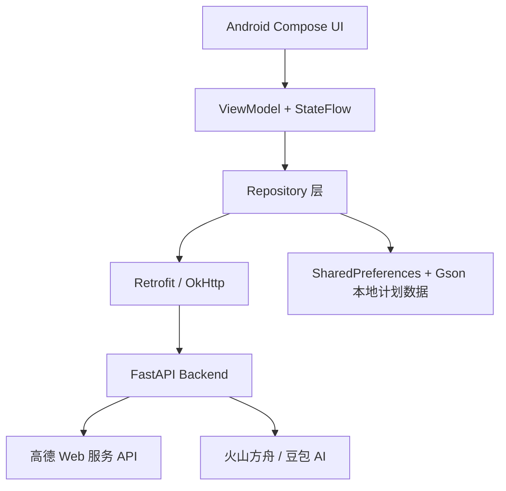

# 途灵 —— 一站式 AI 智能旅行决策管理系统

`travel-app` 是一个 Android + FastAPI 单仓库课程项目，目标是把“旅行灵感探索、真实地点检索、行程计划管理、地图路线规划、AI 行程建议”串成一个可运行的移动端闭环。

当前 Android 开发阶段应用名为“AI旅行助手”，正式包名为 `com.heoclub.aitravel`。

## 当前进度

项目已经不再只是基础框架，而是具备以下核心能力：

- Android 端：Jetpack Compose 三个一级页面“计划 / 探索 / 我的”。
- 探索页：真实高德地图、城市切换、分类 POI、地点搜索、输入提示、真实天气、地点卡片、地点图片和加入计划入口。
- 计划页：创建旅行计划、本地持久化保存、DAY 分组、待规划地点、地点顺序调整。
- 智能计划：输入目的地、日期、天数和偏好，结合高德真实 POI 与 Ark 模型生成逐日结构化行程，并自动保存到本地计划。
- 计划详情：编号 Marker、路线 Polyline、路线距离与耗时、交通方式切换、路线顺序优化预览与确认应用。
- AI 助手：读取当前旅行计划上下文，调用火山方舟 / 豆包模型进行中文问答，并支持结构化行程建议、用户确认后再修改本地计划。
- 后端：FastAPI 代理高德 Web 服务、路线服务、天气服务和 Ark AI 服务，避免 Android 端保存 Web 服务 Key。

## 项目结构

```text
F:\travel-app
├── android/                 # Android Studio 工程
│   ├── app/                 # 单 app 模块
│   ├── gradle/              # Gradle Wrapper 与版本目录
│   ├── gradlew
│   └── gradlew.bat
├── backend/                 # FastAPI 后端
│   ├── app/
│   │   ├── api/             # health / explore / routes / ai 接口
│   │   ├── core/            # 配置读取
│   │   ├── schemas/         # 请求与响应模型
│   │   ├── services/        # 高德、路线、天气、AI 服务封装
│   │   └── scripts/         # Ark Key 验证脚本等
│   ├── tests/
│   ├── .env.example
│   └── requirements.txt
├── docs/                    # 阶段文档与架构说明
├── .gitignore
└── README.md
```

## 技术栈

### Android

- Kotlin 1.9.24
- Jetpack Compose + Material 3
- Navigation Compose
- ViewModel + StateFlow
- Retrofit + OkHttp
- Gson
- Coil
- 高德 Android 地图 SDK
- SharedPreferences + Gson JSON 本地持久化
- Gradle 8.7、AGP 8.5.2、JDK 17
- compileSdk / targetSdk 34，minSdk 28

### Backend

- Python 3.13 验证环境
- FastAPI
- Uvicorn
- Pydantic Settings
- HTTPX
- Pytest
- 高德 Web 服务 API
- 火山方舟 Ark OpenAI-compatible API

## 整体架构



Android 端只保存 Android 地图 SDK Key，用于地图渲染；高德 Web 服务 Key 和 Ark API Key 只放在 FastAPI 后端 `.env` 中。

## 功能说明

### 1. 探索页

探索页是当前 App 的真实地点入口。

已实现：

- 高德地图浅色风格展示。
- 城市搜索与城市切换。
- 分类切换：
  - 景点 `scenic`
  - 美食 `food`
  - 饮品 `drink`
  - 购物 `shopping`
  - 住宿 `lodging`
  - 交通 `transport`
- 根据当前城市和分类加载真实高德 POI。
- 地图 Marker 与底部地点列表联动。
- 地点搜索页调用高德输入提示和地点搜索。
- 城市天气调用高德天气接口。
- 地点图片优先使用高德返回的图片字段；缺失时不编造真实图片。
- 地点可加入指定旅行计划的 DAY 或待规划列表。

### 2. 计划与计划详情

已实现：

- 创建旅行计划。
- 计划数据本地持久化，重启 App 后保留。
- 添加真实高德地点到计划。
- 支持 DAY 地点和待规划地点。
- 防止重复添加同一地点。
- 缺少坐标的地点不会参与路线计算。
- 地点上移 / 下移。
- 计划详情地图展示编号 Marker。
- 后端计算真实路线后，Android 绘制 Polyline。
- 列表展示每段距离和预计耗时。
- 支持步行、驾车、骑行、公交 / 地铁等路线模式。
- 支持“智能优化路线”预览，用户确认后才应用顺序。

### 3. AI 旅行助手

AI 助手不是孤立的聊天机器人，而是可以读取当前旅行计划上下文的行程顾问。

已实现：

- 从计划详情进入 AI 时携带当前 `planId`。
- Android 整理精简计划上下文：
  - 计划名称、目的地、日期
  - DAY 地点
  - 待规划地点
  - 地点名称、类别、地址、图片 URL
  - 路线摘要
  - 天气摘要
  - 最近对话历史
- FastAPI 调用 Ark / 豆包模型生成中文回复。
- 支持加载中、错误、重试和快捷追问。
- 支持结构化建议动作：
  - 移动地点到某个 DAY
  - 调整地点顺序
  - 将待规划地点安排进 DAY
  - 将地点移回待规划
- AI 不直接修改计划，必须由用户确认。
- 应用 AI 建议后会更新本地计划，并支持最近一次 AI 修改撤销。

AI 行为边界：

- AI 可以分析行程是否太赶、解释路线、给天气提醒、建议待规划地点放入哪一天。
- AI 不应声称已经替用户删除、添加或应用修改；所有计划修改必须经过 Android 端确认。
- 如果缺少真实路线、天气、营业时间等数据，AI 应说明“当前暂无可用数据”，不要编造。

### 4. 智能计划生成

- 创建页支持目的地、日期范围、1–10 天、旅行偏好和补充想法。
- 支持城市联想、日期范围选择、旅行节奏、交通偏好和每日活动时段约束。
- 后端先解析城市并检索高德真实 POI，再把候选地点交给 Ark 编排；模型只能引用候选 `sourcePoiId`，不能虚构地点。
- AI 暂不可用时会降级为基于类别与地理距离的规则编排，并在结果中给出提示。
- Android 使用服务端任务 ID 获取真实阶段进度，支持取消、失败重试、地图预览和逐日内容揭示。
- 结果包含真实 POI 比例、重复地点数、数据来源、每日直线距离估算和行程强度。
- 结构化结果一次性写入本地计划，避免只保存一半行程；生成完可直接进入原有计划详情继续编辑和算路线。
- APK 调研证据、接口字段和本项目映射见 `docs/apk-ai-planning-analysis.md`。

## 后端接口

启动后端后可打开：

```text
http://127.0.0.1:8000/docs
```

当前主要接口：

| 模块 | 方法 | 路径 | 说明 |
| --- | --- | --- | --- |
| 基础 | GET | `/` | 欢迎信息 |
| 健康 | GET | `/api/health` | 后端基础健康检查 |
| 健康 | GET | `/api/health/amap` | 高德 Web 服务 Key 配置状态 |
| 健康 | GET | `/api/health/ai` | Ark AI 配置状态 |
| 探索 | GET | `/api/explore/cities/search` | 城市搜索 |
| 探索 | GET | `/api/explore/input-tips` | 地点输入提示 |
| 探索 | GET | `/api/explore/pois/search` | 城市分类 POI / 关键词地点搜索 |
| 探索 | GET | `/api/explore/weather` | 城市天气 |
| 路线 | POST | `/api/routes/segment` | 两点路线 |
| 路线 | POST | `/api/routes/day/calculate` | 单日多地点路线 |
| 路线 | POST | `/api/routes/day/optimize` | 单日地点顺序优化 |
| AI | POST | `/api/ai/chat` | 计划上下文 AI 对话 |
| AI | POST | `/api/ai/plans/generate` | 基于真实 POI 生成结构化多日行程 |
| AI | POST | `/api/ai/plans/jobs` | 创建异步智能规划任务，重复请求 ID 幂等 |
| AI | GET | `/api/ai/plans/jobs/{jobId}` | 查询真实进度、Day 增量地点、规划事件和最终结果 |
| AI | POST | `/api/ai/plans/jobs/{jobId}/cancel` | 取消正在执行的规划任务 |

Android 调试默认使用模拟器宿主地址 `http://10.0.2.2:8000/`。真机配合 `adb reverse tcp:8000 tcp:8000` 时，可这样构建而不修改源码：

```powershell
.\gradlew.bat :app:assembleDebug -PAI_TRAVEL_API_BASE_URL=http://127.0.0.1:8000/
```

## 环境变量与密钥

### 后端 `.env`

复制模板：

```powershell
cd F:\travel-app\backend
Copy-Item .env.example .env
```

然后在 `backend\.env` 中填写本机配置。不要把 `.env` 提交到 Git。

```env
APP_NAME=AI Travel API
APP_VERSION=0.1.0
DEBUG=true
DEV_CORS_ORIGINS=http://localhost:3000,http://localhost:5173,http://127.0.0.1:3000,http://127.0.0.1:5173

AMAP_WEB_SERVICE_KEY=

ARK_API_KEY=
ARK_MODEL=doubao-seed-2-1-pro-260628
ARK_BASE_URL=https://ark.cn-beijing.volces.com/api/v3
ARK_REQUEST_TIMEOUT_SECONDS=240
ARK_MAX_OUTPUT_TOKENS=1200
ARK_TEMPERATURE=0.35
```

说明：

- `AMAP_WEB_SERVICE_KEY` 用于后端调用高德 Web 服务，包括 POI、输入提示、天气和路线。
- `ARK_API_KEY` 用于后端调用火山方舟 / 豆包模型。
- README 只保留变量名，不应出现真实 Key。

### Android `local.properties`

Android 地图 SDK Key 放在：

```text
F:\travel-app\android\local.properties
```

示例：

```properties
sdk.dir=C\:\\Users\\你的用户名\\AppData\\Local\\Android\\Sdk
AMAP_ANDROID_KEY=你的高德 Android 平台 Key
```

`android/local.properties` 已被 `.gitignore` 忽略，不要提交。

## 启动后端

首次安装：

```powershell
cd F:\travel-app\backend
py -3.13 -m venv .venv
.\.venv\Scripts\python.exe -m pip install -r requirements.txt
```

启动服务：

```powershell
cd F:\travel-app\backend
.\.venv\Scripts\python.exe -m uvicorn app.main:app --host 127.0.0.1 --port 8000
```

如果 Android 模拟器需要访问后端，Android Debug 构建默认使用：

```text
http://10.0.2.2:8000/
```

因此后端也可以启动为：

```powershell
.\.venv\Scripts\python.exe -m uvicorn app.main:app --host 0.0.0.0 --port 8000
```

浏览器验证：

```text
http://127.0.0.1:8000/docs
```

## 启动 Android

推荐直接用 Android Studio 打开：

```text
F:\travel-app\android
```

不要只打开仓库根目录，否则 Android Studio 可能不能自动识别 `app` 运行配置。

命令行构建：

```powershell
cd F:\travel-app\android
.\gradlew.bat :app:assembleDebug
```

运行前请确认：

- Android Studio 使用 JDK 17 或内置 JBR。
- `android/local.properties` 中有 Android SDK 路径。
- `AMAP_ANDROID_KEY` 已配置。
- FastAPI 后端正在运行。
- Debug 构建可访问 `http://10.0.2.2:8000/`。

## 联调流程建议

1. 启动 FastAPI。
2. 打开 `http://127.0.0.1:8000/docs`，确认接口列表存在。
3. 在 Swagger 中确认：
   - `/api/health`
   - `/api/health/amap`
   - `/api/health/ai`
4. 用 Android Studio 打开 `F:\travel-app\android`。
5. 运行 `app` 到 Pixel 模拟器。
6. 进入探索页，切换城市并加载真实地点。
7. 添加 2-3 个地点到某个计划 DAY 1。
8. 进入计划详情，检查 Marker、路线、距离、耗时。
9. 点击 AI 助手，询问行程是否太赶或如何优化。
10. 如 AI 返回结构化建议，先预览，再确认应用。

## 测试与验证命令

后端静态编译检查：

```powershell
cd F:\travel-app\backend
.\.venv\Scripts\python.exe -m compileall app
```

后端单元测试：

```powershell
cd F:\travel-app\backend
.\.venv\Scripts\python.exe -m pytest
```

Ark 配置低成本验证：

```powershell
cd F:\travel-app\backend
.\.venv\Scripts\python.exe -m app.scripts.verify_ark
```

Android 构建：

```powershell
cd F:\travel-app\android
.\gradlew.bat :app:assembleDebug
```

## 数据与安全

- 计划数据目前保存在 Android App 私有空间中，使用 `SharedPreferences + Gson JSON`。
- 卸载 App 会清除本地计划数据。
- 当前不做账号登录、云端同步和多设备同步。
- 路线结果不长期持久化，进入计划详情时会重新向后端请求计算。
- 高德 Web 服务 Key 和 Ark API Key 只应保存在 `backend/.env`。
- Android 端只保存高德 Android 地图 SDK Key。
- `.gitignore` 已忽略 `.env`、`local.properties`、虚拟环境、构建产物、APK、签名文件和常见系统文件。

## 常见问题

### 1. 探索页显示“请检查后端服务是否启动”

请检查：

- FastAPI 是否正在运行。
- 后端端口是否是 `8000`。
- Android Debug 构建是否使用 `http://10.0.2.2:8000/`。
- Windows 防火墙是否拦截。
- 后端 `.env` 中 `AMAP_WEB_SERVICE_KEY` 是否配置。

### 2. 地图能显示，但地点、天气或路线加载失败

地图 SDK 和 Web 服务是两套 Key：

- 地图渲染使用 `AMAP_ANDROID_KEY`。
- POI、天气、路线使用 `AMAP_WEB_SERVICE_KEY`。

如果地图正常但接口失败，优先检查后端 `.env` 和高德 Web 服务 Key 的服务权限 / 配额。

### 3. AI 经常超时

当前 Android 和后端都已把 AI 请求超时设置得较长，但模型响应仍取决于网络、模型负载、上下文长度和账号额度。

建议：

- 问题尽量具体。
- 不要一次发送过多地点和过长历史。
- 检查 `ARK_REQUEST_TIMEOUT_SECONDS`。
- 检查火山方舟控制台模型和额度状态。

### 4. 中文输入异常

如果模拟器输入框不能输入中文，通常是模拟器系统输入法问题，不一定是 App Bug。可在模拟器中安装或启用中文输入法后再测试。

### 5. Android Studio 打开根目录后没有运行配置

请打开：

```text
F:\travel-app\android
```

不是只打开：

```text
F:\travel-app
```

## 当前限制

- 暂无登录注册和云端同步。
- 暂无 Room 数据库。
- 暂无实时定位、实时导航和语音导航。
- 暂无小红书、携程、酒店、门票、支付等第三方业务接口。
- AI 不直接修改计划，所有结构化建议都必须由用户确认。
- AI 不做流式输出。
- 地点热度、营业时间、评价等信息以高德返回为准，缺失时不编造。

## 后续路线

建议后续按以下顺序推进：

1. 优化 AI 对话体验：流式输出、上下文裁剪、失败重试、中文提示词稳定性。
2. 增加计划编辑体验：拖拽排序、跨 DAY 移动、待规划批量安排。
3. 增加地点详情：营业时间、费用、电话、图片来源说明。
4. 增加用户系统：登录、云端同步、多设备保存。
5. 增加数据库：后端持久化计划、用户、收藏和历史。
6. 接入更多内容源：小红书 / Wikimedia / 公开旅游数据，但需注意授权和合规。
7. 增加课程展示材料：架构图、接口文档、演示脚本和答辩 PPT。

## Git 提交前检查

提交前建议执行：

```powershell
git status --short
git check-ignore -v backend/.env
git check-ignore -v android/local.properties
git check-ignore -v android/app/build/outputs/apk/debug/app-debug.apk
```

确认以下文件不要提交：

- `backend/.env`
- `backend/.venv/`
- `android/local.properties`
- `android/**/build/`
- `*.apk`
- `*.jks`
- `*.keystore`
- 任何真实 API Key 或签名文件

