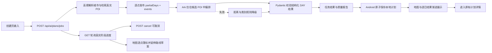

# 圆周旅迹智能计划功能调研与课程项目实现

## 调研范围

本次对工作区中的 `圆周旅迹_5.3.0.apk` 同时做了本地静态分析和真机黑盒交互验证。APK 安装到已连接的 OnePlus PJX110，完整走通“北京—日期—偏好—智能规划—结果”流程；没有上传 APK、图片、源码或密钥。解包中间文件位于工作区 `.apk-analysis/`，该目录已加入 `.gitignore`，避免把第三方 APK 产物提交到课程项目。

本实现借鉴的是交互流程和接口职责，不复制第三方代码、素材、品牌标识或私有服务实现。

## 从 APK 得到的可验证证据

APK 同时包含原生 Android DEX 与 React Native 资源包。智能计划主流程在原生类中可见：

- `JourneyPlanningSelectActivity`：目的地、日期和偏好选择。
- `JourneyPlanningWaitingActivity`：生成等待页，接收 `journeyId`、起止地点和请求 ID，并展示动画。
- `JourneyPlanningResultActivity`：结果页，包含高德 `TextureMapView`、列表和路线结果 ViewModel。
- 页面路由名包括 `planningSelectPage`、`planningWaitingPage`、`planningResultPage`。

DEX 中还能确认以下服务接口：

| 方法 | 路径 | 作用推断 |
| --- | --- | --- |
| GET | `api/slytherin/v1/journey/ai_range` | 查询旧版生成状态或结果 |
| POST | `api/slytherin/v1/journey/ai_range_v2` | 提交智能规划任务 |
| POST | `api/slytherin/v1/journey/cancel_ai_range_v2` | 取消生成 |
| POST | `api/slytherin/v1/journey/ai_range_confirm` | 确认生成结果 |
| POST | `api/slytherin/v1/journey/ai_range_get_poilist` | 获取规划使用的 POI 列表 |

请求字段可见 `journey_id`、`start_poi_id`、`end_poi_id`、`pre_request_id` 和 `request_id`。推送结果模型 `AiPlanningResultMsg` 有失败、成功、生成中三种状态；结果模型包含新增天数、事件、逐日计划和提示信息。这说明原 App 使用“提交任务—持续接收状态—展示逐日结果—确认落库”的异步任务式架构。

截图、静态证据和真机运行共同呈现的流程为：

1. 搜索并选择目的地。
2. 选择日期和多个旅行偏好，也可输入自然语言想法。
3. 进入地图背景的等待页，按“正在编辑第 N 天”逐步反馈，允许取消。
4. 地图 Marker/路线与当天地点卡片逐步出现。
5. 生成完成后展示可继续编辑的多日行程。

真机实测还确认：参考 App 会先给出“行程亮点 / Tips”和“正在编辑第 N 天”，随后切入逐日结果；地点卡和地图标记会继续补齐。课程项目没有照搬其页面，而是把反馈粒度细化到单个地点：每增加一个地点就产生事件、更新当前日草稿并延伸地图连线。

## 本课程项目的等价实现

本项目采用 Jetpack Compose + FastAPI，并进一步实现了与第三方 App 职责相当的服务端异步任务系统：



关键差异：

- 服务端返回任务 ID，Android 轮询真实进度；城市解析、POI 检索、AI 编排和质量检查分别更新阶段。
- 任务完成前持续返回 `partialDays`、`activeDayIndex` 和结构化 `events`；每个地点出现时，地图同步新增 Marker 和路线草案。
- “规划动态”展示的是距离、区域、用餐停留等可验证的用户侧规划依据，不输出或伪造模型私密思维链。
- 多日生成页提供 Day 标签，可在 Day 1/2/3 间切换，不再只能跟随最后一个活动日。
- Ark 优化阶段每 2 秒发布心跳与剩余时间，最多等待 18 秒；超时自动采用已经完成的约束式草案，不会停在 74%。
- 高德 POI 2.0 返回评分、图片和公开营业时段；排程会校验周几闭馆、开放区间、午晚餐时段，缺少数据时只使用保守游览时段并明确标记“待确认”。
- 第一天可以从指定火车站和酒店开始；未指定时自动选取交通枢纽及住宿参考，随后安排同区域知名景点和地方特色餐饮。
- 生成中及保存后的地点卡都能进入地点详情，查看公开营业时间、电话、评分、图片和地址。
- `clientRequestId` 保证重复提交返回同一任务，任务结果保留 30 分钟。
- 只允许模型引用高德候选地点 ID，地点名称、坐标和图片来自真实 POI 数据。
- AI 异常时仍可用规则算法生成，保证课堂演示不完全依赖模型稳定性。
- 响应校验通过后一次性导入 SharedPreferences，避免取消或异常造成半成品计划。
- 取消会同时终止 Android 轮询与服务端后台协程，正在进行的 Ark HTTP 请求也会被取消。
- 输入约束超过参考流程：支持目的地联想、日历范围、轻松/适中/充实、步行/公交/驾车/混合交通和每日活动时段。
- 输出附带质量报告、近似重复地点过滤、每日距离估计和强度分级。

## 生成接口

请求示例：

```json
{
  "destination": "北京",
  "dateRange": "07.16 - 07.20",
  "dayCount": 5,
  "preferences": ["经典必玩", "历史古建", "美食打卡"],
  "freeText": "每天步行不要太多",
  "pace": "BALANCED",
  "transportPreference": "TRANSIT",
  "dailyStart": "09:00",
  "dailyEnd": "20:00",
  "clientRequestId": "由客户端生成的 UUID"
}
```

生成中响应按 `partialDays[].places[]` 返回已完成部分，并用 `events[]` 给出事件类型、用户侧规划依据、天序和地点 ID；完成后 `result.days[].places[]` 返回最终高德来源字段、经纬度、建议开始/结束时间和短说明，并带 `warnings` 标明是否发生规则降级。

## 安全与边界

- 高德 Web 服务 Key 与 Ark Key 仍只存在后端 `.env`，不会写入 Android 请求或日志。
- 模型提示明确禁止编造票价、营业时间和预约规则。
- Android 使用日历范围选择器，并校验最多 10 天；日期范围和天数始终同步传给服务端。
- 当前任务状态保存在单进程内存中；生产级多实例部署可迁移到 Redis/Celery，并由轮询升级为 SSE/WebSocket 推送。

## 真机验证

2026-07-16 在 OnePlus PJX110 上通过 Android Studio/ADB 完成端到端验证：

- 城市英文输入 `Beijing` 能返回“北京市”真实城市联想。
- 创建 3 日任务后，真机展示服务端 56%“AI 正在编排跨天顺序与游玩节奏”。
- Ark 超时时自动降级，没有让整个任务失败；结果保存 12 个高德真实 POI，质量报告显示重复 ID 为 0。
- 点击“查看完整行程”可以进入现有计划详情，高德地图绘制编号 Marker 与真实路线，并可继续切换 DAY、交通方式和调整地点顺序。
